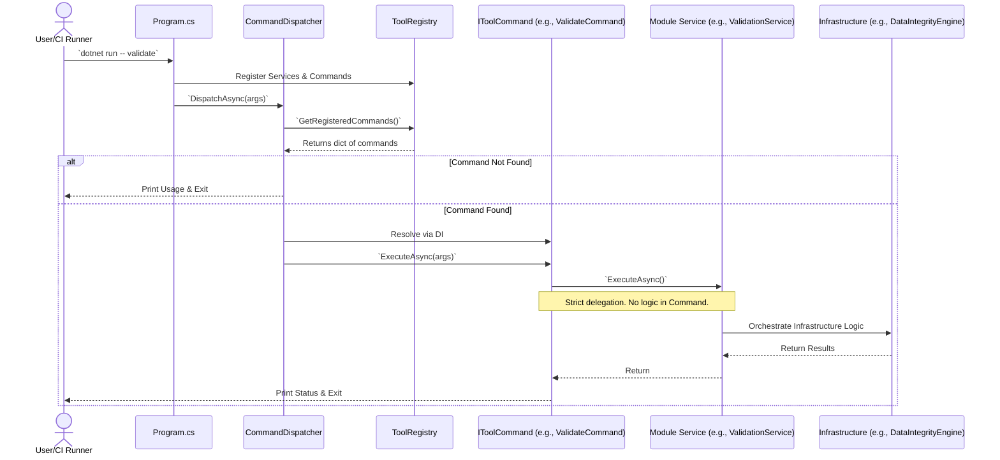

# Command Flow

This document visualizes the strict flow of execution for any tool run in the Enterprise Tool Center.

## Sequence

```mermaid
sequenceDiagram
    actor CLI as User/CI Runner
    participant Program as Program.cs
    participant Dispatcher as CommandDispatcher
    participant Registry as ToolRegistry
    participant Command as IToolCommand (e.g., ValidateCommand)
    participant Service as Module Service (e.g., ValidationService)
    participant Engine as Infrastructure (e.g., DataIntegrityEngine)

    CLI->>Program: `dotnet run -- validate`
    Program->>Registry: Register Services & Commands
    Program->>Dispatcher: `DispatchAsync(args)`
    Dispatcher->>Registry: `GetRegisteredCommands()`
    Registry-->>Dispatcher: Returns dict of commands

    alt Command Not Found
        Dispatcher-->>CLI: Print Usage & Exit
    else Command Found
        Dispatcher->>Command: Resolve via DI
        Dispatcher->>Command: `ExecuteAsync(args)`
        Command->>Service: `ExecuteAsync()`
        Note over Command,Service: Strict delegation. No logic in Command.
        Service->>Engine: Orchestrate Infrastructure Logic
        Engine-->>Service: Return Results
        Service-->>Command: Return
        Command-->>CLI: Print Status & Exit
    end
```
